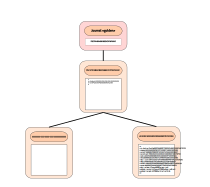
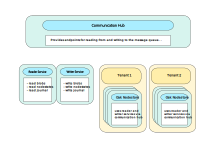

# Oak ZeroMQ Nodestore

The ZeroMQ nodestore is a distributed nodestore for Apache Oak using ZeroMQ as its communication layer.

## NodeStates
We adopt the Oak NodeState model also for the storage backend. Nodestates contain properties and references to their child nodestates. They are serialised and identified by the hash of their serialisation (content-addressable storage). Therefore the serialised nodestate is the basic unit of storage (key/value pair or document) and can be treated like any other blob.



## Journal
A reference to the root nodestate is stored separately in a journal head and defines a repository. Several root nodestates and therefore journals/repositories can share the same blobstore bucket. These root nodestates can even belong to different tenants. A repository can be cloned in no time by creating a new journal referencing the same root nodestate.

## The log
Changes are written to a log, which gives them a global order. When a commit is merged, the blobs and nodestates are written first, then the new journal entry. All participating Oak instances listen to and process the log and its commits, including their own, in the same manner, and therefore eventually have the same state. In the case of conflicts, all instances use the same resolution mechanism.

In addition to Oak instances, other processes listen to the log:
- a blobstore writer writes nodestates and blobs to the blob store, where they are available for reads
- some process updates the indexes
- some process removes unreferenced blobs from the blob store
- some process gathers statistics and sends them to a separate queue
- and so on.



## Security
The current PoC implementation does not use any encryption and therefore assumes that blobstore buckets and the logs are kept separate between tenants. If tenants share a common blobstore and/or the log, the data would need to be encrypted before sending it to the log and decrypted when read by the Oak nodestore. This is what we're aiming for so the PoC should do that eventually and check the performance impact. An alternative would be a per-tenant blob cache doing the encryption and decryption.

The nice thing about using ZeroMQ for communication is that it provides us with a pluggable architecture where such a cache can be easily added, as long as we keep the communication protocol stable.

## PoC implementation
### Communication hub
The "comm-hub" process is the communication backbone. It opens two sockets, one for writing messages to the queue, and one for reading.

The message format is a bit verbose but makes debugging easier. Fields are separated by a space. The first field starts with a service identifier (currently "read" or "write"), a dash "-", and a type ("req" for request, "rep" for reply). The second field identifies the requesting thread («pid»@«host»-«threadId»). The third field should be a message id set by the requester and echoed in the reply, but I think that's not fully implemented yet. In a reply message, the fourth field indicates the message status: «N» for "not found", «F» for "fault/error", «C» for "continued" (this is a multi-part message and more parts will follow), or «E» "end" (this is the end of a multi-part message or the only message part). The remaining fields are service dependent.

### Reader service
The reader service provides blobs/nodestates («blob» and «hasblob») and the current root of a journal («journal»). For example
```
read-req 33624@Axels-MacBook-Pro.local-306 2 hasblob 8578AEA22CF6ADE2C845ECE9C375B4DA
read-rep 33624@Axels-MacBook-Pro.local-306 2 E false
```

### Writer service
The writer service stores blobs/nodestates and the journal(s) in the blobstore. For efficiency the «braw» command is used most of the time. It contains the blob in binary format in the last field of the message. For blobs exceeding the max message size, they are split into b64 encoded chunks and sent to the queue using «b64+» (start with blobId as parameter), «b64d» (with b64 encoded data), and «b64!» (end). Upon success the service responds with an empty «E» message.

A journal entry is written as
```
write-req 33624@Axels-MacBook-Pro.local-306 618 journal golden DE6E888A0CCF62B208982F63CC7BB6FA 5B77940AA4269AB940431E4C54D2D786
```
where the «journal» command is followed by the name of the journal/repository, followed by the new root, followed by the old (expected) root.

### Nodestore implementation
The frontend, the actual NodeStore implementation, consists of two parts.

The "merge" method uses the builder to recursively diff against the current state and generate new nodestates along the way. These new nodestates are sent to the queue (writer service). Finally the new root nodestate is written and its id is sent to the queue (writer service) as the new journal root. The thread then waits to be notified if the merge was successful or not, which is the responsibility for the second part.

The second part is a thread which continuously listens on the queue for new journal messages. If it sees one and the journal/repository name matches its own, it tries to apply it (rebasing if necessary). If this fails (conflict) and the commit is not its own, it just skips it. If the commit happens to be its own, it notifies the merge thread about success or failure to apply it.

## Build it

```shell
git clone https://github.com/ahanikel/jackrabbit-oak
cd jackrabbit-oak
mvn -DskipTests clean install
```
## Run the backend processes
```shell
cd oak-run/target
```
### Communication hub
Open a new terminal window and run
```shell
java -jar oak-run-1.42.0-zeromq.jar comm-hub tcp://localhost:8000 tcp://localhost:8001
```
### Reader service
Open a new terminal window and run
```shell
java -jar oak-run-1.42.0-zeromq.jar simple-blob-reader-service simple:///tmp/blobstore tcp://localhost:8000 tcp://localhost:8001
```
assuming that `/tmp/blobstore` does not exist.
### Writer service
Open a new terminal window and run
```shell
java -jar oak-run-1.42.0-zeromq.jar simple-blob-writer-service simple:///tmp/blobstore tcp://localhost:8000 tcp://localhost:8001
```
### ZeroMQ Listener for debugging
If you want to see live what messages are being sent back and forth, open a new terminal and run
```shell
java -jar oak-run-1.42.0-zeromq.jar simple-queue-listener tcp://localhost:8001
```
but beware that this will produce lots of output and will slow down the initial sling start
considerably. Press `CTRL-C` when you've seen enough.
## Run the frontend it with Sling
```shell
cd org-apache-sling-starter
mvn -DskipTests clean install
cd target
# edit slingfeature-tmp/feature-oak_tar.json (TBD)
JAVA_HOME=/usr/local/opt/openjdk@8 $JAVA_HOME/bin/java -jar dependency/org.apache.sling.fe
ature.launcher.jar -f slingfeature-tmp/feature-oak_tar.json
```
